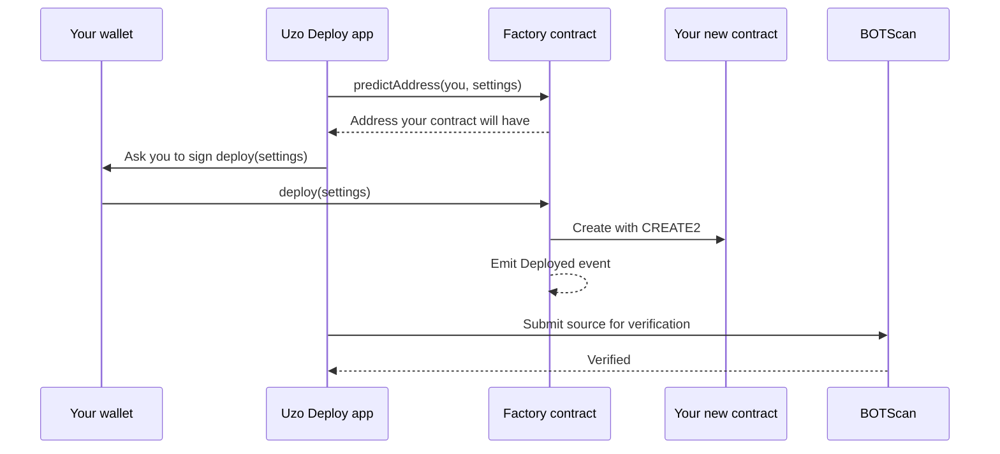

import DeployStatus from "/snippets/deploy-status.mdx";

<DeployStatus />

Learn what happens between selecting **Sign and deploy** and seeing your verified contract on BOTScan.

## The short version

You never send code to the chain yourself. Uzo has already deployed one **factory** contract per template. A factory is a contract whose only job is to create copies of one template. When you sign, your wallet calls the factory, and the factory creates your contract with the settings you chose.

The app then asks BOTScan to verify the new contract. Verification publishes the source code on BOTScan and proves it matches the code on chain, so anyone can read what your contract does.



## Factories

There is one factory per template and version: a token factory, an NFT factory and a tip jar factory, each at version 1. Their addresses are on [Contracts](/deploy/contracts).

The factories have:

- **No owner.** Nobody, including Uzo, has special rights over them.
- **No fee.** You pay only the network's gas.
- **No pause and no upgrade path.** The code can't be changed after deployment.

Because the factories can't change, a new version of a template means a new factory at a new address. Contracts already deployed stay as they are.

## CREATE2: your address before you sign

The factories create contracts with CREATE2. CREATE2 is an EVM opcode that works out a new contract's address from the factory's address, a salt and the contract's code, instead of from a counter. Same inputs, same address.

That's why the **Review** step can show your contract address before you sign. The app calls the factory's `predictAddress` function, and after the deploy it checks the real address matches.

The salt includes your wallet address. The factory builds it as `keccak256(abi.encode(msg.sender, userSalt))`, where `msg.sender` is the wallet that calls the factory. So nobody else can deploy to the address predicted for you: their wallet address gives a different salt.

## The Deployed event

Every factory records each new contract with the same event:

```solidity Deployed event
event Deployed(address indexed deployer, address indexed instance, bytes32 indexed templateId, uint16 version);
```

| Field | Meaning |
| --- | --- |
| `deployer` | The wallet that called the factory. |
| `instance` | The new contract's address. |
| `templateId` | Which template, as a short string such as `uzo.token`. |
| `version` | The template version. |

[My contracts](/deploy/my-deployments) and the [stats page](/deploy/stats) are built from these events. There's no separate database of deployments.

## uzoTemplate(): identify a Uzo contract

Every contract created by a Uzo factory has a `uzoTemplate()` function:

```solidity Template contracts
function uzoTemplate() external pure returns (bytes32 id, uint16 version);
```

It returns the same template ID and version as the `Deployed` event. The values for each template are on [Contracts](/deploy/contracts#uzotemplate-values).

Any contract can copy this function, so it's a label, not proof. To check that a contract came from Uzo, look for a `Deployed` event from a [Uzo factory](/deploy/contracts) with that contract as the `instance`. The tip page does this check before it shows a tip form.

## Verification

After the deploy lands, the app sends the address and the transaction hash to its verification service. The service never takes source code from your browser. It reads the factory's `Deployed` event and your transaction from the chain, works out the settings you used, and submits the matching source from the uzo-deploy repo to BOTScan.

See [Verification](/deploy/verification) for how to check it and what to do if it fails.

## Related pages

<CardGroup cols={2}>
  <Card title="Contracts" icon="file-code" href="/deploy/contracts">
    Factory addresses and template IDs.
  </Card>
  <Card title="Security" icon="shield" href="/deploy/security">
    What Uzo can and can't do.
  </Card>
</CardGroup>
