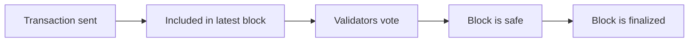

BOT Chain uses [Parlia](/reference/glossary) consensus with fast finality, so your app can treat a transaction as settled within a couple of seconds. This page explains how that works and how to check it from code.

## Why it matters

"Included in a block" and "final" are not the same thing. A block can, in rare cases, be replaced by another block at the same height. A final block can't be. Apps that move value, such as a bridge, an exchange or a payment checkout, should wait for finality. A simple counter app doesn't need to.

## How it works

### Block production

BOT Chain's docs describe its consensus as Parlia, the engine from BNB Smart Chain, with a difficulty-based fork choice and [FFG](/reference/glossary) (Casper's "friendly finality gadget") for finality. BOT Chain's homepage describes it as hybrid SPoA consensus. See the [JSON-RPC page](https://dev-docs.botchain.ai/docs/Developers/json-rpc-endpoint/) and [botchain.ai](https://www.botchain.ai/en).

In practice:

- A fixed set of validators takes turns producing blocks.
- Each validator produces several blocks in a row before handing over, as described in [BEP-341](https://github.com/bnb-chain/BEPs/blob/master/BEPs/BEP-341.md). On 2026-10-01 each validator produced 16 consecutive blocks on both networks.
- A new block arrives about every **0.75 seconds**. BOT Chain's homepage states this, and we measured exactly 750 seconds for 1,000 blocks on both networks on 2026-10-01.

### Finality

Validators vote on recent blocks. Once enough validators have voted, a block is **justified**, and then **finalized**. A finalized block can't be reverted without a large share of validators breaking the rules and being penalized for it.

BOT Chain's homepage describes average finality of about 0.9 seconds. Rather than rely on a fixed number, ask the node which block is final. The standard JSON-RPC block tags do this:

| Tag | Meaning |
| --- | --- |
| `latest` | The newest block. It could still be replaced. |
| `safe` | A block that has been justified by validator votes. |
| `finalized` | A block that is final. |

In our checks on 2026-10-01, `finalized` was usually 1 to 2 blocks behind `latest` on both networks, and `safe` was 1 block behind. At 0.75 seconds per block, that means a transaction was final within a couple of seconds.



## Check finality from your code

<CodeGroup>
```bash cast
cast block finalized --field number --rpc-url https://rpc.bohr.life
cast block latest --field number --rpc-url https://rpc.bohr.life
```

```js viem
import { createPublicClient, http } from "viem";

const client = createPublicClient({
  transport: http("https://rpc.bohr.life"),
});

const latest = await client.getBlock({ blockTag: "latest" });
const finalized = await client.getBlock({ blockTag: "finalized" });

console.log("latest", latest.number, "finalized", finalized.number);
```
</CodeGroup>

To wait until a transaction is final, compare its block number with the `finalized` block:

```js wait-final.js
import { createPublicClient, http } from "viem";

const client = createPublicClient({
  transport: http("https://rpc.bohr.life"),
});

export async function waitForFinality(hash) {
  const receipt = await client.waitForTransactionReceipt({ hash });
  while (true) {
    const finalized = await client.getBlock({ blockTag: "finalized" });
    if (finalized.number >= receipt.blockNumber) return receipt;
    await new Promise((resolve) => setTimeout(resolve, 500));
  }
}
```

## How long should my app wait?

| What you're doing | Wait for |
| --- | --- |
| Updating a UI after a click | The receipt (`latest`). |
| Showing a payment as received | `finalized`. |
| Releasing goods or funds in response to a deposit | `finalized`, and check the receipt status. |

## Related pages

<CardGroup cols={2}>
  <Card title="Gas and fees" icon="fuel" href="/get-started/bot-chain/gas-and-fees">
    What transactions cost.
  </Card>
  <Card title="JSON-RPC" icon="terminal" href="/reference/json-rpc/overview">
    Every method the RPC supports.
  </Card>
  <Card title="Bridge tracking" icon="route" href="/guides/bridge/tracking-transfers">
    Follow a transfer across chains.
  </Card>
  <Card title="What is BOT Chain" icon="blocks" href="/get-started/bot-chain/overview">
    The bigger picture.
  </Card>
</CardGroup>
