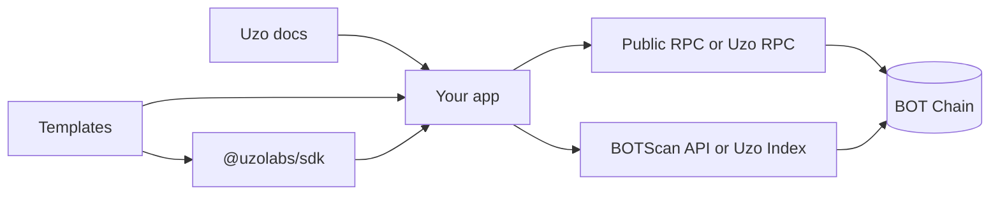

Uzo has four parts that sit between your app and BOT Chain. This page shows how they connect and which ones you can use today.

## Why it matters

Some parts of Uzo are live and some are still being built. Knowing which is which tells you what to install now and what to do by hand for the time being.

## How it works

- **Docs** (this site) explain each task and give you tested values and code.
- **SDK** gives your TypeScript code chain definitions, contract addresses, ABIs and a BOTScan API client. Helpers for BDEX, the bridge and the paymaster are planned. It is built on [viem](https://viem.sh).
- **Templates** are starter projects (contracts, scripts and a frontend) that use the SDK. You clone one and change it.
- **Infrastructure** covers Uzo RPC, an endpoint with log queries and WebSockets, and Uzo Index, an event indexer. Until they exist, your app talks to the public RPC and the BOTScan API directly.

## Status of each part

| Part | Status | Use today |
| --- | --- | --- |
| Docs | Live | You're reading them. |
| [SDK](/sdk/overview) | Early release: `@uzolabs/sdk` 0.2.0 on [npm](https://www.npmjs.com/package/@uzolabs/sdk). Chains, contracts and explorer modules are available. BDEX, bridge and paymaster modules are planned. | `npm install @uzolabs/sdk viem`, or define the chain yourself with viem's `defineChain` as in [Build your first dApp](/get-started/first-dapp). |
| [Templates](/templates/overview) | Partly available. The [templates repo](https://github.com/uzolabs/templates) marks `token`, `nft`, `dex-integration` and `gasless-app` as ready. `bridge-integration` and `ai-agent` are planned. | Copy a ready template, or follow the [Guides](/guides/environment/choose-a-toolchain), which do the same work by hand. |
| [Uzo RPC](/infrastructure/rpc/overview) | Planned | Use the public RPC URLs in [Networks](/reference/networks). |
| [Uzo Index](/infrastructure/index/overview) | Planned | Use the [BOTScan explorer API](/reference/explorer-api). |
| [Hackathon kit](/hackathons/overview) | Planned for the UNN event (late January 2027) | The participant pages already work as a checklist. |

The [Status](/infrastructure/status) page is updated whenever any of these change.

## Related pages

<CardGroup cols={2}>
  <Card title="Why Uzo" icon="lightbulb" href="/get-started/why-uzo">
    The problems Uzo is solving.
  </Card>
  <Card title="Quickstart" icon="zap" href="/get-started/quickstart">
    Deploy a contract with tools that work today.
  </Card>
  <Card title="SDK overview" icon="package" href="/sdk/overview">
    What the SDK does today and what's next.
  </Card>
  <Card title="Status" icon="activity" href="/infrastructure/status">
    The current status of every Uzo product.
  </Card>
</CardGroup>
