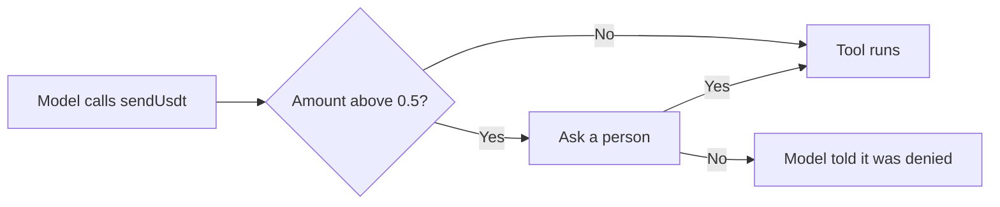

import TestnetOnly from "/snippets/testnet-only.mdx";

In this guide you make your agent stop and ask a person before any payment above a threshold, and carry on only if they say yes.

<TestnetOnly />

## How it works

AI SDK 7 lets you set an approval rule per tool with the `toolApproval` option of `generateText`. The rule runs in your code, before the tool runs, and returns one of these:

| Return value | What happens |
| --- | --- |
| `"not-applicable"` | The tool runs straight away. |
| `"user-approval"` or `{ type: "user-approval", reason }` | The call pauses. `generateText` returns with a `tool-approval-request` part. |
| `"approved"` | The tool runs, recorded as approved. |
| `"denied"` | The tool doesn't run. The model is told it was denied. |

When a call pauses, you ask a person, then send their answer back as a `tool-approval-response` message and call `generateText` again. The model never sees the threshold and can't answer the approval itself.



## What you'll build

An updated `agent.ts` that pays small amounts on its own and asks in the terminal before anything above 0.5 USDT.

## Prerequisites

- The `bot-agent` project, `.env` and `tools.ts` from [Tool calling](/guides/ai-agents/tool-calling).

## Steps

<Steps>
  <Step title="Replace agent.ts">
    ```ts agent.ts
    import { anthropic } from "@ai-sdk/anthropic";
    import { generateText, stepCountIs, type ModelMessage, type ToolApprovalResponse } from "ai";
    import { createInterface } from "node:readline/promises";
    import { getBalances, sendUsdt } from "./tools.ts";

    const model = anthropic("claude-sonnet-5-5");
    const tools = { getBalances, sendUsdt };
    const APPROVAL_ABOVE_USDT = 0.5; // Payments above this wait for a person

    const system = [
      "You manage a USDT wallet on BOT Chain testnet.",
      "Check the balance before you send. Only send to addresses the user gives you.",
      "If a tool returns an error or a payment is not approved, explain why and do not retry it.",
      "After a payment, give the amount, the recipient and the BOTScan link.",
    ].join("\n");

    const terminal = createInterface({ input: process.stdin, output: process.stdout });
    const messages: ModelMessage[] = [{ role: "user", content: process.argv[2] ?? "What's my balance?" }];

    while (true) {
      const result = await generateText({
        model,
        system,
        tools,
        messages,
        stopWhen: stepCountIs(8),
        toolApproval: {
          // Small payments run straight away. Larger ones stop and ask.
          sendUsdt: ({ amount }) =>
            Number(amount) > APPROVAL_ABOVE_USDT
              ? { type: "user-approval", reason: `Payment above ${APPROVAL_ABOVE_USDT} USDT` }
              : "not-applicable",
        },
      });
      messages.push(...result.responseMessages);

      const requests = result.content.filter((part) => part.type === "tool-approval-request" && !part.isAutomatic);
      if (requests.length === 0) {
        console.log(result.text);
        break;
      }

      // Ask a person about each paused call, then hand the answers back to the model.
      const responses: ToolApprovalResponse[] = [];
      for (const request of requests) {
        if (request.type !== "tool-approval-request") continue;
        const answer = await terminal.question(`Approve ${request.toolCall.toolName} ${JSON.stringify(request.toolCall.input)}? (y/n) `);
        const approved = answer.trim().toLowerCase() === "y";
        responses.push({ type: "tool-approval-response", approvalId: request.approvalId, approved, reason: approved ? undefined : "Declined by the owner" });
      }
      messages.push({ role: "tool", content: responses });
    }
    terminal.close();
    ```

    What changed from the tool calling version:

    - `toolApproval.sendUsdt` receives the tool's input and decides. Payments of 0.5 USDT or less return `"not-applicable"` and run at once.
    - The script keeps a `messages` array. Each round adds the model's messages with `result.responseMessages`, so the next call picks up where the last one stopped.
    - Parts with `isAutomatic` set were decided by your rule, not a person, so the script only asks about the others.
    - A refusal includes a `reason`. The model receives it and can tell the user why the payment didn't happen.
  </Step>

  <Step title="Run a small payment">
    ```bash Terminal
    npx tsx --env-file=.env agent.ts "Send 0.001 USDT to 0xFirstAddress"
    ```

    It runs without asking.
  </Step>

  <Step title="Run a large payment">
    ```bash Terminal
    npx tsx --env-file=.env agent.ts "Send 0.8 USDT to 0xFirstAddress"
    ```

    The script stops and asks. Type `n` to refuse or `y` to let the tool run. Even after you approve, `sendUsdt` still applies its own checks.
  </Step>
</Steps>

## Verify it worked

In a test run, a 0.001 USDT payment went through with no prompt ([transaction on BOTScan](https://scan.bohr.life/tx/0xe87c0b97e8b01fab3cd6a4338043bd7f92504c85c6f1f2b9acc2e8146165cbe4)). A 0.8 USDT payment stopped at the prompt. With `n`, the tool didn't run and the model received:

```text Output
Approve sendUsdt {"to":"0x3C44CdDdB6a900fa2b585dd299e03d12FA4293BC","amount":"0.8"}? (y/n) n
tool-result sendUsdt {"type":"execution-denied","reason":"Declined by the owner"}
```

With `y`, the tool ran and its own balance check refused, because the wallet held only 0.020366 USDT:

```text Output
Approve sendUsdt {"to":"0x3C44CdDdB6a900fa2b585dd299e03d12FA4293BC","amount":"0.8"}? (y/n) y
tool-result sendUsdt {"type":"json","value":{"ok":false,"error":"Not enough USDT. Balance: 0.020366"}}
```

The `tool-result` lines come from extra logging in the test. Your script prints the model's reply after them.

## Approvals outside a terminal

A real agent usually can't wait at a terminal prompt. The same flow works across time:

1. When `generateText` returns approval requests, save the `messages` array and each `approvalId`.
2. Send the request to a person through a channel you control, such as a dashboard, chat message or email, with the tool name and input.
3. When they answer, load the messages, add the `tool-approval-response`, and call `generateText` again.

Check who answered before you accept it. An approval link that anyone can open is no approval at all.

<Note>
Approval in your app protects you only while your server and the agent's key are safe. Keep the funds in an [agent vault](/guides/ai-agents/agent-vaults) so the daily limit and allowlist still hold if they aren't. For the largest payments, keep them out of the agent's reach entirely: the vault owner, ideally a multisig, makes them directly.
</Note>

## Troubleshooting

<AccordionGroup>
  <Accordion title="The script never asks, even for large amounts">
    The rule compares `Number(amount)` with `APPROVAL_ABOVE_USDT`. Check the threshold, and check the tool name in `toolApproval` matches the key in `tools` exactly.
  </Accordion>
  <Accordion title="The model calls the tool again after a refusal">
    The system prompt asks it not to retry. If it still does, each new call goes through the same rule and asks again, so nothing is paid without approval.
  </Accordion>
  <Accordion title="I've seen needsApproval on tool definitions">
    That's the older way to require approval. AI SDK 7 deprecates it in favor of `toolApproval` on `generateText`, which also lets the decision depend on the input.
  </Accordion>
</AccordionGroup>

## Next steps

<CardGroup cols={2}>
  <Card title="Identity hooks" icon="id-card" href="/guides/ai-agents/identity-hooks">
    Check counterparties on chain.
  </Card>
  <Card title="Security checklist" icon="shield" href="/guides/ai-agents/security-checklist">
    Review your setup before real funds.
  </Card>
</CardGroup>
