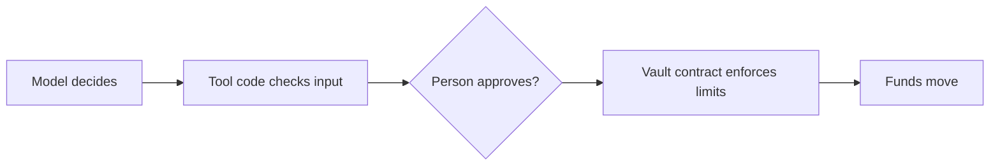

This section shows you how to let an AI agent pay and transact on BOT Chain while keeping hard limits on what it can do with the money.

## The problem with prompt rules

You can tell a model "never spend more than 10 USDT a day". That's a request, not a rule. A model can misread an instruction, get confused across a long conversation, or be talked into something by text it reads: a web page, an email, or a tool result written by an attacker. This is called prompt injection, and there's no reliable fix for it inside the model.

If the agent's key can move all the funds, a single bad decision can move all the funds. So the limits have to live somewhere the model can't change them.

## Three layers

Put each rule in the strongest layer that can enforce it.

| Layer | What it does | Can the model bypass it? |
| --- | --- | --- |
| **Vault contract** | Holds the funds. The agent key can only call `pay`, within a daily limit, to allowed recipients. The owner can pause and withdraw. | No. The chain enforces it. |
| **Tool code** | Validates addresses and amounts, simulates before sending, returns errors as data. | Not through the tool, but it runs on your server. If the agent's key leaks, it's gone. |
| **Human approval** | Pauses large or unusual actions until a person says yes. | No, as long as approval happens outside the model. |

The system prompt is still useful. It tells the model how to behave well. Just don't let it be the only thing between the model and the funds.

## What to build

1. **Put funds in a vault.** The owner key stays with a person. The agent key is only the operator. See [Agent vaults](/guides/ai-agents/agent-vaults).
2. **Set limits in the contract.** A daily cap that resets at 00:00 UTC, and a recipient allowlist. See [Spending limits](/guides/ai-agents/spending-limits).
3. **Write narrow tools.** Each tool does one thing, checks its input, and simulates before sending. See [Tool calling](/guides/ai-agents/tool-calling).
4. **Add an approval step** for anything above a threshold. See [Human approval](/guides/ai-agents/human-approval).
5. **Optionally, check counterparties** against an identity or reputation registry. See [Identity hooks](/guides/ai-agents/identity-hooks).
6. **Run the checklist** before you add real funds. See [Security checklist](/guides/ai-agents/security-checklist).

## What the code in this section uses

- [viem](https://viem.sh) for chain access.
- The [AI SDK](https://ai-sdk.dev) with [zod](https://zod.dev) schemas for tools. The examples use Anthropic's Claude through `@ai-sdk/anthropic`, but any provider the AI SDK supports works.
- [OpenZeppelin Contracts](https://docs.openzeppelin.com/contracts) for the vault.

The contracts in this section aren't audited. Treat them as a starting point and get them reviewed before you hold meaningful funds.

## Next steps

<CardGroup cols={2}>
  <Card title="Agent vaults" icon="vault" href="/guides/ai-agents/agent-vaults">
    Hold agent funds in a contract.
  </Card>
  <Card title="Tool calling" icon="wrench" href="/guides/ai-agents/tool-calling">
    Give a model BOT Chain tools.
  </Card>
</CardGroup>
