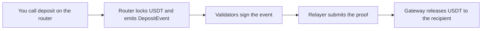

This page explains how the BOT Chain bridge moves USDT between BOT Chain and other networks, so you can integrate it safely.

## What it moves

The bridge carries **USDT only**, between BOT Chain and three networks:

| Network | Mainnet chain ID | Testnet |
| --- | --- | --- |
| Ethereum | 1 | Sepolia (11155111) |
| BNB Smart Chain | 56 | BSC testnet (97) |
| Tron | 728126428 | Nile (3448148188) |

These are the destination chain IDs the bridge contracts reported on 2026-10-02. Read them yourself with the script in [Limits and fees](/guides/bridge/limits-and-fees). BOT Chain runs a bridge app at [bridge.botchain.ai](https://bridge.botchain.ai/), and its own [bridge docs](https://dev-docs.botchain.ai/docs/Bridge/) cover the design.

## Lock and release

The bridge doesn't mint wrapped tokens. Each side holds a pool of real USDT:

- **Bridging out**, you lock USDT in the router on BOT Chain, and the gateway on the destination chain releases the same amount, minus the fee, from its own balance.
- **Bridging in**, you lock USDT in the gateway on the other chain, and the router on BOT Chain releases it to you.

Validators watch for deposit events and sign what they see. A relayer collects enough signatures and submits them to the destination chain. Each transfer can only be claimed once.

Because transfers are paid from liquidity, the USDT you receive is the native USDT of that chain, not a bridged copy. It also means a transfer depends on the destination side having enough USDT.

## The contracts

| Contract | Role |
| --- | --- |
| Bridge router on BOT Chain | The contract you approve and call `deposit` on. An upgradeable proxy. |
| Bridge contract on BOT Chain | Holds per-destination settings, such as the fee. The router's `Bridge()` returns its address. |
| Gateway on each other chain | Releases USDT on arrival and accepts deposits for the way in. |

All addresses, and the USDT resource ID that `deposit` needs, are in [Contract addresses](/reference/contract-addresses#bridge-gateways-on-other-chains).

## Decimals change between chains

USDT has 6 decimals on BOT Chain, Ethereum and Tron, but 18 on BNB Smart Chain. You always pass the BOT Chain amount (6 decimals) to `deposit`. The bridge converts it. When you check what arrived on BNB Smart Chain, format it with 18 decimals. See [USDT and decimals](/guides/defi/tokens/usdt-and-decimals).

## Fees and limits

Bridging out costs a percentage of the amount with a minimum, and has a minimum and maximum amount. BOT Chain's docs say bridging in has no bridge fee. These values live in the contracts and can change, so read them before every transfer. See [Limits and fees](/guides/bridge/limits-and-fees).

## Next steps

<CardGroup cols={2}>
  <Card title="Limits and fees" icon="gauge" href="/guides/bridge/limits-and-fees">
    Read the live values.
  </Card>
  <Card title="Bridge USDT out" icon="log-out" href="/guides/bridge/bridge-out">
    Send USDT to another network.
  </Card>
  <Card title="Track a transfer" icon="map-pin" href="/guides/bridge/tracking-transfers">
    Follow it from deposit to arrival.
  </Card>
  <Card title="Contract addresses" icon="file-code" href="/reference/contract-addresses">
    Routers, gateways and the resource ID.
  </Card>
</CardGroup>
