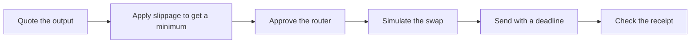

This page helps you choose between BDEX V2 and V3 for a swap, and explains how to get a price quote before you trade.

BDEX is BOT Chain's decentralized exchange. It runs two kinds of pools: V2 pools, which spread liquidity over every price, and V3 pools, which let liquidity providers concentrate it in a price range. Both are deployed on mainnet and testnet. Addresses are in [Contract addresses](/reference/contract-addresses).

## V2 or V3

| | BDEX V2 | BDEX V3 |
| --- | --- | --- |
| Swap fee | 0.30% on every pool | 0.05%, 0.30% or 1.00%, set per pool |
| Pools per token pair | One | One per fee tier |
| Quote with | Router02 `getAmountsOut` (a view function) | QuoterV2 `quoteExactInputSingle` (simulate it) |
| Swap with | Router02 `swapExactTokensForTokens` and friends | SwapRouter `exactInputSingle` and friends |
| Native BOT | Separate `ETH` functions | Send `value` and the router wraps it |
| Best for | Simple code, small or long-tail pairs | Better prices where liquidity is concentrated |

Fees come from BOT Chain's [DEX core concepts](https://dev-docs.botchain.ai/docs/DEX/core-concepts/).

Liquidity decides the price you get, not the version. On testnet on 2026-10-01, quoting 0.0005 WBOT to USDT returned 0.000512 USDT on the 0.05% V3 pool, 0.005159 on the 0.30% pool and 0.001093 on the 1.00% pool. Testnet pools are thin, so prices vary widely. Always quote every candidate pool and pick the best.

## How a swap works

1. **Quote.** Ask the router or quoter how much you'd get for your input, at the current pool state.
2. **Set a minimum.** Take a little off the quote for price movement. See [Slippage and deadlines](/guides/defi/swaps/slippage-and-deadlines).
3. **Approve.** Let the router spend your input token. Approve only the amount you're swapping. Native BOT needs no approval.
4. **Simulate.** Run the swap as a call first. If it would revert, you find out without paying gas.
5. **Send** with a deadline, so the swap can't execute much later at a stale price.

## Quotes are not promises

A quote reads the pool at one moment. Between the quote and your transaction, other trades can move the price. The minimum output you pass to the router is what protects you: if the swap would return less, it reverts.

V3 quoting has one more detail. QuoterV2's functions aren't marked `view`: they run the swap and revert to return the result. Call them with `simulateContract` (or `eth_call`), never in a transaction.

## The UniversalRouter

BDEX also deploys a UniversalRouter and Permit2, listed in [Contract addresses](/reference/contract-addresses). The UniversalRouter takes encoded commands rather than plain function calls, and the BDEX routing API that builds those routes isn't public. These guides use Router02 and SwapRouter directly.

## Next steps

<CardGroup cols={2}>
  <Card title="Swap on BDEX V2" icon="repeat" href="/guides/defi/swaps/bdex-v2">
    Quote, approve and swap with Router02.
  </Card>
  <Card title="Swap on BDEX V3" icon="repeat-2" href="/guides/defi/swaps/bdex-v3">
    Find a pool, quote with QuoterV2 and swap.
  </Card>
  <Card title="Slippage and deadlines" icon="timer" href="/guides/defi/swaps/slippage-and-deadlines">
    Pick safe defaults.
  </Card>
  <Card title="BDEX API" icon="arrow-left-right" href="/reference/bdex-api">
    List pools and tokens over HTTP.
  </Card>
</CardGroup>
