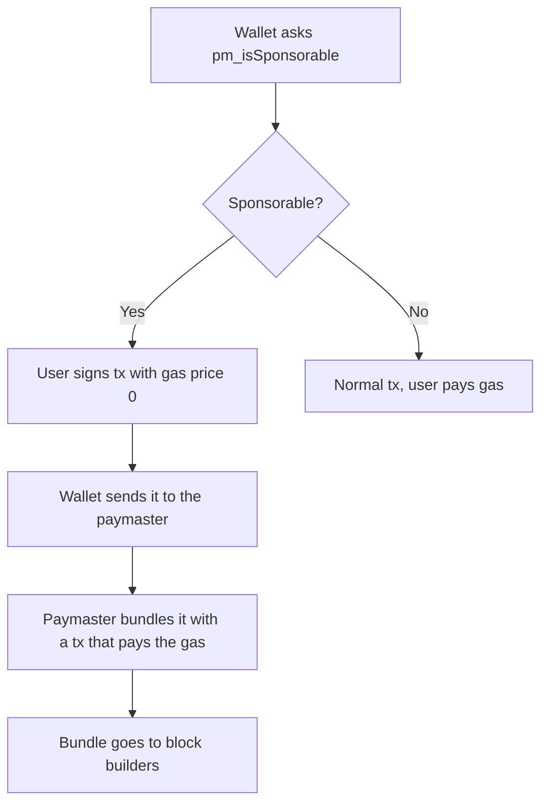

This page explains how BOT Chain's EOA paymaster design lets a normal wallet send a transaction without paying gas, and what you can and can't rely on today.

<Warning>
  **No paymaster endpoint is confirmed for BOT Chain (chain 677) or its testnet.** BOT Chain documents the design and API, but we found no public endpoint to use. To sponsor gas today, use [meta-transactions](/guides/gasless/meta-transactions). See [Known limitations](/get-started/bot-chain/known-limitations#no-confirmed-paymaster-for-bot-chain).
</Warning>

## What it is

An EOA paymaster lets an ordinary wallet (an externally owned account, or EOA) send a transaction with a gas price of 0. A paymaster service pays the gas instead. Unlike [meta-transactions](/guides/gasless/meta-transactions), your contracts don't change, and users sign a normal transaction, not a separate message.

BOT Chain describes this design on its [EOA paymaster page](https://dev-docs.botchain.ai/docs/Developers/eoa-paymaster/) and names NodeReal's MegaFuel as an implementation. MegaFuel is documented as a BNB Chain service.

## How it works



In more detail, based on BOT Chain's description:

1. **Check.** The wallet or app calls `pm_isSponsorable` on the paymaster with the transaction details.
2. **Sign.** If the paymaster will pay, the user signs the transaction with a gas price of 0.
3. **Send to the paymaster.** The signed transaction goes to the paymaster's `eth_sendRawTransaction`, not to a public RPC.
4. **Bundle.** The paymaster creates its own transaction with a higher gas price that covers the cost, and bundles both so they're included together or not at all.
5. **Build.** The bundle goes to MEV block builders, which pass blocks to the validators that propose them.
6. **Charge.** The paymaster deducts the gas from the sponsor's account.

Sponsors set **policies** that decide what they pay for, for example which senders or recipients, which tokens, and how much.

## Why you can't send a 0 gas price to the public RPC

The bundle has to reach a builder that accepts it. A normal node rejects a transaction with a gas price of 0. We tested this on testnet on 2026-10-02: sending a 0 gas price transaction from a new wallet to `https://rpc.bohr.life` failed with `gasPrice too low`. So the paymaster needs its own endpoint and a path to builders, which is the part not confirmed for BOT Chain.

## The API

`pm_isSponsorable` takes one object with the transaction fields, every value hex-encoded:

| Field | Meaning |
| --- | --- |
| `to` | The contract or address the transaction calls. |
| `from` | The user's address. |
| `value` | The BOT sent, in wei. |
| `data` | The calldata. |
| `gas` | The gas limit. |

BOT Chain's docs say it returns `Sponsorable` (a boolean) and `SponsorPolicy` (the name of the policy that matched). The same page also uses the name `gm_sponsorable` once. The API specification defines `pm_isSponsorable`, so use that.

Here is how a script would use it, if your provider gives you an endpoint:

```ts paymaster.ts
import { createPublicClient, encodeFunctionData, http, numberToHex, parseAbi } from "viem";
import { privateKeyToAccount } from "viem/accounts";
import { botChainTestnet } from "@uzolabs/sdk/chains";

// No public paymaster is confirmed for BOT Chain. Set this to an endpoint your provider gives you.
const PAYMASTER_URL = process.env.PAYMASTER_URL as string;
const GUEST_BOOK = "0x7962412A92E5553E66C794c3a352422DEB7BAc27";

const account = privateKeyToAccount(process.env.BOT_PRIVATE_KEY as `0x${string}`);
const chainClient = createPublicClient({ chain: botChainTestnet, transport: http() });
const paymaster = createPublicClient({ chain: botChainTestnet, transport: http(PAYMASTER_URL) });

const data = encodeFunctionData({
  abi: parseAbi(["function sign(string message) returns (uint256 id)"]),
  functionName: "sign",
  args: ["Sponsored by a paymaster"],
});
const gas = await chainClient.estimateGas({ account, to: GUEST_BOOK, data });

// 1. Ask whether the paymaster will pay for this transaction. Every value is hex.
const result = await paymaster.request<{
  Method: "pm_isSponsorable";
  Parameters: [{ to: `0x${string}`; from: `0x${string}`; value: `0x${string}`; data: `0x${string}`; gas: `0x${string}` }];
  ReturnType: { Sponsorable?: boolean; sponsorable?: boolean; SponsorPolicy?: string; sponsorPolicy?: string };
}>({
  method: "pm_isSponsorable",
  params: [{ to: GUEST_BOOK, from: account.address, value: "0x0", data, gas: numberToHex(gas) }],
});
// BOT Chain's docs capitalize the fields. Read both spellings until a live endpoint confirms one.
const sponsorable = result.Sponsorable ?? result.sponsorable ?? false;
console.log("Sponsorable:", sponsorable, "Policy:", result.SponsorPolicy ?? result.sponsorPolicy);
if (!sponsorable) process.exit(0);

// 2. Sign a legacy transaction with a gas price of 0 and send it to the paymaster, not the public RPC.
const nonce = await chainClient.getTransactionCount({ address: account.address });
const signed = await account.signTransaction({
  type: "legacy",
  chainId: botChainTestnet.id,
  to: GUEST_BOOK,
  data,
  gas,
  gasPrice: 0n,
  nonce,
});
const hash = await paymaster.request({ method: "eth_sendRawTransaction", params: [signed] });
console.log(`Sent: ${botChainTestnet.blockExplorers.default.url}/tx/${hash}`);
```

Two details matter:

- **A legacy transaction.** It sets `gasPrice` directly, which is what the paymaster design expects.
- **The send goes to the paymaster.** If it goes to the public RPC, it's rejected, as shown above.

## Is it safe for users?

The user still signs a real transaction, so the usual checks apply: read what it does before you sign. The paymaster can see and delay the transaction, but can't change it without invalidating the signature. If the paymaster never includes it, the nonce stays unused, and the user can replace it with a normal paid transaction.

## In the Uzo SDK

<Info>
  **Planned.** A paymaster module for the [Uzo SDK](/sdk/paymaster/overview) is planned. It isn't in `@uzolabs/sdk` 0.2.0.
</Info>

The [gasless app template](/templates/gasless-app/index) includes an optional paymaster adapter, off by default. It tries the paymaster first and falls back to the relayer paying. It hasn't been tested against a real paymaster.

## Next steps

<CardGroup cols={2}>
  <Card title="Meta-transactions" icon="pen-line" href="/guides/gasless/meta-transactions">
    The approach that works today.
  </Card>
  <Card title="Known limitations" icon="triangle-alert" href="/get-started/bot-chain/known-limitations#no-confirmed-paymaster-for-bot-chain">
    What's missing and the workarounds.
  </Card>
</CardGroup>
