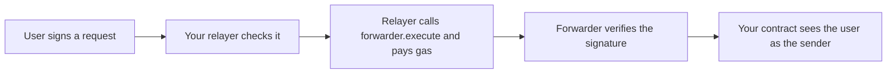

This page helps you choose how to let users act on BOT Chain without holding any BOT for gas.

## Why gasless

Every transaction needs [gas](/reference/glossary), paid in BOT by the account that sends it. A new user who only holds USDT, or nothing at all, can't send anything. If your app pays the gas for them, they can start right away.

## Two approaches

| | Meta-transactions (ERC-2771) | EOA paymaster |
| --- | --- | --- |
| How it works | The user signs a message. Your relayer sends it through a forwarder contract and pays the gas. | The user signs a normal transaction with a gas price of 0. A paymaster bundles it with a transaction that pays for it. |
| Works on BOT Chain today | Yes. Tested on testnet. | No public paymaster is confirmed for BOT Chain. |
| Contract changes | Your contract must extend `ERC2771Context` and use `_msgSender()`. | None. |
| Who runs it | You run the relayer. | A paymaster provider. |
| Works with existing contracts | Only ones built for ERC-2771. | Any contract. |

**Use meta-transactions today.** They need nothing from BOT Chain beyond a normal RPC. The paymaster approach is worth knowing about, but you can't rely on it yet. See [EOA paymaster](/guides/gasless/eoa-paymaster) and [Known limitations](/get-started/bot-chain/known-limitations#no-confirmed-paymaster-for-bot-chain).

## How a meta-transaction flows

The user's wallet asks for a signature, not a transaction, so it never shows a gas fee. Your contract records the user, not the relayer, as the sender.

## What it costs you

Your relayer pays for every request. On testnet on 2026-10-01, a relayed guest book message used 136,073 gas, or about 0.0027 tBOT at 20 gwei. Budget for this, and protect the relayer with allowlists and rate limits so nobody can drain it. See [Run a relayer](/guides/gasless/run-a-relayer).

## Next steps

<CardGroup cols={2}>
  <Card title="Meta-transactions" icon="pen-line" href="/guides/gasless/meta-transactions">
    Sign and relay a request with viem.
  </Card>
  <Card title="Run a relayer" icon="server" href="/guides/gasless/run-a-relayer">
    A small server that pays gas safely.
  </Card>
  <Card title="EOA paymaster" icon="credit-card" href="/guides/gasless/eoa-paymaster">
    How the paymaster design works.
  </Card>
  <Card title="Gasless app template" icon="layout-template" href="/templates/gasless-app/index">
    A full guest book app with a relayer.
  </Card>
</CardGroup>
