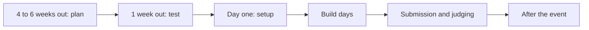

Plan and run a BOT Chain hackathon with this logistics checklist, from the weeks before the event to the final demos.

Adapt it to your event. Timings and numbers marked as suggestions are starting points, not rules.

## Overview

## 4 to 6 weeks before

- [ ] Set the date, venue, format (in person, online or hybrid) and team size.
- [ ] Write the rules: who can enter, team size, whether earlier code is allowed, and that everything is built and judged on BOT Chain testnet.
- [ ] Choose tracks. Start from the [example tracks](/hackathons/tracks).
- [ ] Decide the judging criteria and weights. Start from the [judging rubric](/hackathons/organizers/judging-rubric) and publish it with the rules.
- [ ] Confirm sponsors and prizes in writing before you announce them.
- [ ] Recruit mentors who have deployed on BOT Chain testnet. Ask them to complete the [quickstart](/get-started/quickstart).
- [ ] Plan tBOT funding. Read the [faucet plan](/hackathons/organizers/faucet-plan).
- [ ] Open registration. Collect each participant's wallet address if you plan to pre-fund wallets.

## 1 week before

- [ ] Fund the organizer wallet and pre-fund participant wallets with [fund-wallets.sh](/hackathons/organizers/faucet-plan#pre-fund-wallets).
- [ ] Send participants the [day-one checklist](/hackathons/day-one-checklist) and ask them to finish it before arriving.
- [ ] Run the [quickstart](/get-started/quickstart) on the venue network. Check that `https://rpc.bohr.life`, `https://scan.bohr.life` and `https://github.com` load.
- [ ] Check the [product status](/infrastructure/status) page and tell participants which Uzo tools are live.
- [ ] Prepare the submission form. Ask for the fields in [Submission](/hackathons/submission), and collect contract addresses in a `team,address` format you can check with [verify-submissions](/hackathons/organizers/verify-submissions).
- [ ] Brief judges on the rubric and the scoring sheet.

## Day one

- [ ] Opening: rules, tracks, judging criteria, deadlines, code of conduct and where to get help.
- [ ] Run the [setup workshop](/hackathons/workshops/setup), then the [first contract workshop](/hackathons/workshops/first-contract).
- [ ] Staff a help desk with the [hackathon FAQ](/hackathons/faq) open.
- [ ] Remind everyone: never share a private key or recovery phrase. Mentors never need one.

## Build days

- [ ] Check in with each team at least once. Ask what's blocking them.
- [ ] Watch the organizer wallet's balance and top up teams that run out.
- [ ] Post the submission deadline in UTC and local time, and repeat it.
- [ ] A few hours before the deadline, remind teams to verify their contracts.

## Submission and judging

- [ ] Close submissions at the stated time.
- [ ] Run [check_submissions.py](/hackathons/organizers/verify-submissions) on every contract address. Send teams with unverified contracts a short window to fix it, if your rules allow.
- [ ] Judges score with the rubric. Have at least two judges score each project.
- [ ] Demos: set a strict time per team (for example 3 minutes demo plus 2 minutes questions) and keep to it.
- [ ] Announce results with each winning project's repo and BOTScan link.

## After the event

- [ ] Ask participants to send unused tBOT back to the organizer wallet or the [Uzo Labs faucet](/get-started/bot-chain/get-testnet-tokens#give-back-unused-tbot).
- [ ] Publish the list of projects and repos.
- [ ] Collect feedback: what blocked teams, what took too long.
- [ ] Tell the Uzo docs team what was missing, by opening an issue on [GitHub](https://github.com/uzolabs). See [Contributing](/reference/contributing).

## Next steps

<CardGroup cols={2}>
  <Card title="Faucet plan" icon="droplets" href="/hackathons/organizers/faucet-plan">
    Make sure every team has tBOT.
  </Card>
  <Card title="Judging rubric" icon="scale" href="/hackathons/organizers/judging-rubric">
    Criteria and suggested weights.
  </Card>
</CardGroup>
