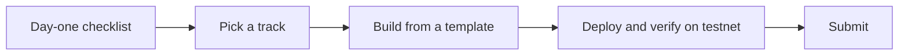

Use the hackathon kit to get your team from zero to a deployed, verified BOT Chain project, or to run a BOT Chain hackathon as an organizer.

<Info>
  The kit is being prepared for the UNN event (late January 2027). The participant and organizer pages work today. Tooling that doesn't exist yet, such as the AI agent workshop, is marked on its page.
</Info>

## Who it's for

- **Participants.** Students and developers who know some JavaScript and have heard of Ethereum, but may never have deployed a contract.
- **Mentors and workshop leads.** People running setup and build sessions during the event.
- **Organizers.** Anyone planning a BOT Chain hackathon: funding wallets, judging and checking submissions.

## Why a kit

Hackathon time disappears into setup: installing tools, finding a faucet, adding a network to a wallet, working out why a deploy failed. The kit puts the answers in one place so teams spend their time building. Everything runs on BOT Chain testnet, so nobody needs real money.

## How a team uses it

1. Work through the [day-one checklist](/hackathons/day-one-checklist) before or at the start of the event.
2. Pick an idea from the [example tracks](/hackathons/tracks).
3. Start from a [template](/templates/overview) if one fits.
4. Read the [submission requirements](/hackathons/submission) early, so you know what you're aiming for.

Sponsors, prizes, dates and venue are announced by each event's organizers, not on this site.

## For participants

<CardGroup cols={2}>
  <Card title="Day-one checklist" icon="list-checks" href="/hackathons/day-one-checklist">
    Wallet, tBOT, tools and a first deploy.
  </Card>
  <Card title="Example tracks" icon="map" href="/hackathons/tracks">
    Project ideas for AI agents, payments, DeFi and more.
  </Card>
  <Card title="Submission" icon="upload" href="/hackathons/submission">
    What to hand in and how to check it.
  </Card>
  <Card title="Hackathon FAQ" icon="messages-square" href="/hackathons/faq">
    Fixes for the most common blockers.
  </Card>
</CardGroup>

## For organizers

<CardGroup cols={2}>
  <Card title="Run a hackathon" icon="calendar" href="/hackathons/organizers/run-a-hackathon">
    A logistics checklist from planning to demos.
  </Card>
  <Card title="Faucet plan" icon="droplets" href="/hackathons/organizers/faucet-plan">
    Make sure every team has tBOT.
  </Card>
  <Card title="Judging rubric" icon="scale" href="/hackathons/organizers/judging-rubric">
    Criteria and suggested weights.
  </Card>
  <Card title="Verify submissions" icon="badge-check" href="/hackathons/organizers/verify-submissions">
    Check every contract with BOTScan's API.
  </Card>
</CardGroup>
