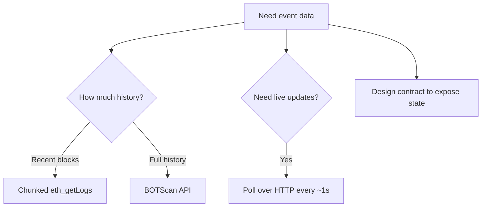

Read contract events and follow new blocks on BOT Chain even though the public RPCs don't officially support `eth_getLogs` or WebSockets.

## The limitation

- **`eth_getLogs`.** BOT Chain's [JSON-RPC page](https://dev-docs.botchain.ai/docs/Developers/json-rpc-endpoint/) says it's disabled on the public endpoints and points to third-party providers. In our tests (2026-10-01 and 2026-10-03) it answered bounded ranges, such as 5,000 or 50,000 blocks. A query from block 0 to the latest block failed.
- **WebSockets.** No WebSocket URL is published. `wss://` versions of both RPC URLs failed to connect, so `eth_subscribe` isn't available.

## Why it matters

Most dApp frameworks and indexers expect both. Without them:

- Activity feeds, token transfer histories and leaderboards can't simply query events.
- Indexers that read events over RPC, such as Ponder, need `eth_getLogs` to backfill.
- Libraries that default to WebSocket subscriptions fail to connect.

## Workarounds



| Workaround | Use for | Where |
| --- | --- | --- |
| Chunked `eth_getLogs` | Recent events, small ranges | [Known limitations](/get-started/bot-chain/known-limitations#event-queries) |
| BOTScan API | Full history, decoded logs | [Use the BOTScan API](/guides/data/explorer-api) |
| HTTP polling | New blocks and state changes | [Known limitations](/get-started/bot-chain/known-limitations#no-websocket-endpoint) |
| Read state instead | Feeds, counts, recent items | [Events without getLogs](/guides/frontend/events-without-getlogs) |
| Your own node | Unlimited ranges | [Index chain data](/guides/data/indexing) |

### Bounded getLogs

Ask for a fixed range instead of the whole chain. This reads the last 5,000 blocks of testnet USDT logs with Foundry:

```bash recent-logs.sh
LATEST=$(cast block-number --rpc-url https://rpc.bohr.life)
cast logs --from-block $((LATEST - 5000)) --to-block "$LATEST" \
  --address 0x75edC9335175Fc0552D51D48439F229c10420fe3 \
  --rpc-url https://rpc.bohr.life
```

It returned in about 2 seconds on 2026-10-03. No output means no events in that range. Use chunks of a few thousand blocks and loop for longer ranges.

### Poll instead of subscribing

With viem, use an `http` transport. Its `watch` actions (`watchBlockNumber`, `watchContractEvent`) poll automatically. Set `pollingInterval: 1_000`, since blocks come about every 0.75 seconds. A full example is in [Known limitations](/get-started/bot-chain/known-limitations#no-websocket-endpoint).

<Note>
  `watchContractEvent` polls with `eth_getLogs` under the hood. It works on small ranges today, but because the method is documented as disabled, also have a fallback such as polling a state variable.
</Note>

## What will change

[Uzo RPC](/infrastructure/rpc/overview) is planned to support `eth_getLogs` and WebSockets, and [Uzo Index](/infrastructure/index/overview) is planned to serve indexed events. Both are planned, not live.

## Troubleshooting

<AccordionGroup>
  <Accordion title="eth_getLogs times out or returns a gateway error">
    The range is too large. Query from a recent block, not 0, and split long ranges into chunks of 5,000 blocks or fewer.
  </Accordion>
  <Accordion title="WebSocket connection fails">
    BOT Chain has no WebSocket endpoint. Replace `webSocket()` with `http()` in viem, or `WebSocketProvider` with `JsonRpcProvider` in ethers, and poll.
  </Accordion>
  <Accordion title="Events show up late">
    Lower the polling interval to 1 second. Polling faster than the 0.75-second block time doesn't help.
  </Accordion>
</AccordionGroup>

## Next steps

<CardGroup cols={2}>
  <Card title="Events without getLogs" icon="list" href="/guides/frontend/events-without-getlogs">
    Frontend patterns that don't need event queries.
  </Card>
  <Card title="Use the BOTScan API" icon="search" href="/guides/data/explorer-api">
    Read decoded logs from the explorer.
  </Card>
</CardGroup>
