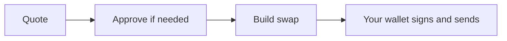

import InDevelopment from "/snippets/status-in-development.mdx";

The planned BDEX module will let you quote and build swaps on BDEX V2 and V3 with typed helpers. Until it ships, you can do all of this today with viem and the SDK's addresses and ABIs.

<InDevelopment />

## What it will do

`@uzolabs/sdk/bdex` is planned for SDK 0.3.0. It will cover four areas:

| Area | Planned functions | Page |
| --- | --- | --- |
| BDEX V2 | `getAmountsOutV2`, `buildSwapExactTokensForTokensV2` | [V2](/sdk/bdex/v2) |
| BDEX V3 | `getPoolV3`, `quoteExactInputSingleV3` | [V3](/sdk/bdex/v3) |
| Routing API | `createRoutingClient` | [Routing API](/sdk/bdex/routing-api) |
| Approvals | ERC-20 and Permit2 approval builders | [Approvals](/sdk/bdex/approvals) |

The function names come from the SDK plan. Their parameters and return types aren't published yet, so these pages describe what each function is for, not its final signature.

## How it will work

Like the rest of the SDK, the module won't hold keys or send transactions. Quote functions read from the chain. Build functions return a transaction request that you sign and send with your own wallet client.



Two safety checks are planned, and their error classes already exist in 0.2.0:

- **Slippage cap.** A swap that asks for more slippage than the maximum throws [`SlippageTooHighError`](/sdk/reference/errors#reserved-for-planned-modules).
- **Router allowlist.** Calldata from the Routing API that targets an unknown router throws [`RouterNotAllowedError`](/sdk/reference/errors#reserved-for-planned-modules).

## Do it today

Everything the module will do is possible now with viem plus [`@uzolabs/sdk/contracts`](/sdk/contracts/overview), which already ships the BDEX addresses and typed ABIs. This quote runs as is:

```ts quote.ts
import { createPublicClient, formatUnits, http, parseUnits } from "viem";
import { botChainTestnet } from "@uzolabs/sdk/chains";
import { bdexV2Router02Abi, getAddresses, TOKENS } from "@uzolabs/sdk/contracts";

const client = createPublicClient({ chain: botChainTestnet, transport: http() });
const { bdexV2Router02, wbot, usdt } = getAddresses(botChainTestnet.id);

const amountIn = parseUnits("1", TOKENS.BOT.decimals);
const amounts = await client.readContract({
  address: bdexV2Router02,
  abi: bdexV2Router02Abi,
  functionName: "getAmountsOut",
  args: [amountIn, [wbot, usdt]],
});
console.log(`1 tBOT quotes at ${formatUnits(amounts[1], TOKENS.USDT.decimals)} USDT`);
```

```text Output
1 tBOT quotes at 16.055264 USDT
```

Your number depends on the pool at the time. For full swaps, follow these guides:

<CardGroup cols={2}>
  <Card title="Swap on BDEX V2" icon="repeat" href="/guides/defi/swaps/bdex-v2">
    Quote, approve and swap through Router02.
  </Card>
  <Card title="Swap on BDEX V3" icon="repeat-2" href="/guides/defi/swaps/bdex-v3">
    Compare fee tiers and swap through SwapRouter.
  </Card>
  <Card title="Slippage and deadlines" icon="shield" href="/guides/defi/swaps/slippage-and-deadlines">
    Set safe minimums before you build a swap.
  </Card>
  <Card title="BDEX API" icon="database" href="/reference/bdex-api">
    List pairs and pools without reading the chain.
  </Card>
</CardGroup>
