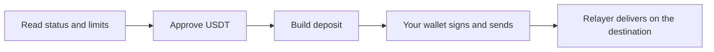

import InDevelopment from "/snippets/status-in-development.mdx";

The planned bridge module will read the USDT bridge's live status and limits and build deposit transactions from BOT Chain. You can do both today with viem and the SDK's bridge ABI.

<InDevelopment />

## What it will do

`@uzolabs/sdk/bridge` is planned for SDK 0.4.0.

| Planned function | Purpose | Page |
| --- | --- | --- |
| `getBridgeStatus` | Whether the bridge is paused. | [Status and limits](/sdk/bridge/status-and-limits) |
| `getBridgeLimits` | Minimum and maximum amounts and the fee. | [Status and limits](/sdk/bridge/status-and-limits) |
| `getBotGasConfig` | The "bot gas" settings for transfers into BOT Chain. | [Status and limits](/sdk/bridge/status-and-limits) |
| `buildBridgeDeposit` | An unsigned USDT deposit transaction. | [buildBridgeDeposit](/sdk/bridge/build-deposit) |

The function names come from the SDK plan. Parameters and return types aren't final. Input that fails a check, such as a paused bridge or an amount outside the limits, is planned to throw [`BridgeValidationError`](/sdk/reference/errors#reserved-for-planned-modules).

## BOT Chain is the only source in v1

The first version builds deposits **from** BOT Chain only. Bridging into BOT Chain from Ethereum, BNB Smart Chain or Tron starts on those chains, through gateway contracts whose ABIs aren't published. The SDK lists their addresses in [`EXTERNAL_BRIDGE`](/sdk/contracts/constants#external_bridge) so you can watch for transfers, but it doesn't call them.

## Do it today

The SDK already ships the bridge router address for both networks, `botBridgeAbi` and `USDT_RESOURCE_ID`. These guides use them and were run on testnet:

<CardGroup cols={2}>
  <Card title="Limits and fees" icon="gauge" href="/guides/bridge/limits-and-fees">
    Read pause state, limits, fees and destinations.
  </Card>
  <Card title="Bridge USDT out" icon="log-out" href="/guides/bridge/bridge-out">
    Approve and deposit from a script.
  </Card>
  <Card title="Track a transfer" icon="radar" href="/guides/bridge/tracking-transfers">
    Follow a deposit to the destination chain.
  </Card>
  <Card title="How the bridge works" icon="waypoints" href="/guides/bridge/overview">
    Router, relayers, fees and refunds.
  </Card>
</CardGroup>
