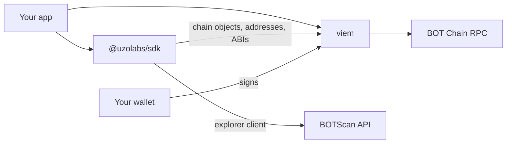

import EarlyRelease from "/snippets/status-early-release.mdx";

`@uzolabs/sdk` gives you typed chain objects, contract addresses, ABIs and a BOTScan client for BOT Chain, so you can build with viem without copying values by hand.

<EarlyRelease />

## What it does

The SDK is a small TypeScript library that works alongside [viem](https://viem.sh). It doesn't replace viem. It gives viem the BOT Chain values you would otherwise look up and paste in yourself:

- **Chain objects** for mainnet (677) and testnet (968), with the RPC, explorer and Multicall3 already set.
- **Contract addresses** for WBOT, USDT, BDEX, Permit2, the Universal Router and the bridge router, typed for each network.
- **ABIs** fetched from verified contracts on BOTScan.
- **An explorer client** that reads address and contract details from BOTScan's API. It needs no API key.
- **Typed errors** with stable codes you can check in your code.

## Design principles

- **Built for viem.** Every export works with viem's own clients and actions. viem v2 is a peer dependency, so you choose its version.
- **No keys.** The SDK never touches private keys and never signs. You sign with your own wallet client.
- **No guessing.** When a value isn't public, such as a Routing API URL, the SDK asks you for it. If you don't pass it, the SDK throws `MissingConfigError` instead of falling back to a default.
- **Small imports.** Each module has its own subpath. `@uzolabs/sdk/chains` is under 2 KB gzipped.
- **Checked against the chain.** CI fails if a committed ABI no longer matches BOTScan. A nightly job checks that every address still has code.

## Modules

| Import | What it contains | Status |
| --- | --- | --- |
| [`@uzolabs/sdk/chains`](/sdk/chains/overview) | `botChain`, `botChainTestnet` | Available in 0.2.0 |
| [`@uzolabs/sdk/contracts`](/sdk/contracts/overview) | Addresses, ABIs, constants | Available in 0.2.0 |
| [`@uzolabs/sdk/explorer`](/sdk/explorer/overview) | BOTScan client | Available in 0.2.0 |
| [`@uzolabs/sdk/bdex`](/sdk/bdex/overview) | BDEX V2 and V3 quotes, swaps, Routing API | Planned for 0.3.0 |
| [`@uzolabs/sdk/bridge`](/sdk/bridge/overview) | Bridge reads and USDT deposits | Planned for 0.4.0 |
| [`@uzolabs/sdk/paymaster`](/sdk/paymaster/overview) | EOA paymaster client | Planned for 0.5.0 |
| `@uzolabs/sdk` | Every published module, plus the [error classes](/sdk/reference/errors) | Available in 0.2.0 |

The version numbers for the planned modules come from the [SDK README](https://github.com/uzolabs/uzo-sdk#readme). No release dates have been announced. Until those modules ship, each of their pages links to a guide that does the same job with viem today.

## How it fits

Your app creates viem clients from the SDK's chain objects and calls contracts using its addresses and ABIs. Your wallet does all the signing.

## Before you start

Read [Known limitations](/get-started/bot-chain/known-limitations). Two of them affect how you use the SDK: the mainnet RPC doesn't serve `eth_getLogs`, and there's no public WebSocket endpoint.

## Next steps

<CardGroup cols={2}>
  <Card title="Install the SDK" icon="download" href="/sdk/installation">
    Add it to your project.
  </Card>
  <Card title="SDK quickstart" icon="zap" href="/sdk/quickstart">
    Read a block in five lines.
  </Card>
  <Card title="Contracts" icon="file-code" href="/sdk/contracts/overview">
    Addresses, ABIs and constants.
  </Card>
  <Card title="Source on GitHub" icon="github" href="https://github.com/uzolabs/uzo-sdk">
    Code, issues and releases.
  </Card>
</CardGroup>
