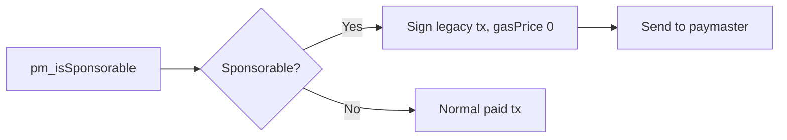

import InDevelopment from "/snippets/status-in-development.mdx";

The planned paymaster module will let your app ask an EOA paymaster whether it will pay for a transaction, then send it a transaction with a gas price of 0. No paymaster endpoint is confirmed for BOT Chain, so you'll always pass the URL yourself.

<InDevelopment />

<Warning>
  **No paymaster endpoint is confirmed for BOT Chain (chain 677) or its testnet.** The module can't ship a default URL. To sponsor gas today, use [meta-transactions](/guides/gasless/meta-transactions).
</Warning>

## What it will do

`@uzolabs/sdk/paymaster` is planned for SDK 0.5.0. It's one function, [`createPaymasterClient`](/sdk/paymaster/client), which wraps the two calls in BOT Chain's EOA paymaster design:

| Step | Call | Sent to |
| --- | --- | --- |
| Ask whether the paymaster will pay | `pm_isSponsorable` | The paymaster URL |
| Send the signed transaction with a gas price of 0 | `eth_sendRawTransaction` | The paymaster URL, never the public RPC |

## Why the URL is required

The paymaster has to bundle your transaction with one that pays the gas and pass it to block builders. A public node can't do that: it rejects a 0 gas price with `gasPrice too low`, which we saw on testnet on 2026-10-02. So the client needs an endpoint from a paymaster provider. If you don't pass one, it's planned to throw [`MissingConfigError`](/sdk/reference/errors#reserved-for-planned-modules). Errors from the paymaster itself are planned to throw [`PaymasterError`](/sdk/reference/errors#reserved-for-planned-modules).

## Do it today

<CardGroup cols={2}>
  <Card title="Meta-transactions" icon="pen-line" href="/guides/gasless/meta-transactions">
    Gasless transactions that work on BOT Chain now.
  </Card>
  <Card title="EOA paymaster" icon="credit-card" href="/guides/gasless/eoa-paymaster">
    The design, the API and a viem script for when you have an endpoint.
  </Card>
  <Card title="Gasless app template" icon="layout-template" href="/templates/gasless-app/index">
    A relayer app with an optional paymaster adapter.
  </Card>
  <Card title="Gasless overview" icon="fuel" href="/guides/gasless/overview">
    Compare the options.
  </Card>
</CardGroup>
