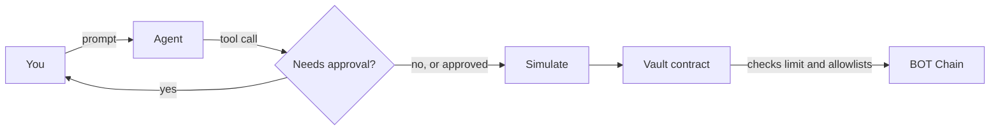

import TemplateInDevelopment from "/snippets/status-template-in-development.mdx";

Build an AI agent that spends from a contract vault with on-chain limits today, using the hand-written AI agent guides, while the AI agent template is in development.

<TemplateInDevelopment />

{/* screenshot: the AI agent template's web app, once the template is published (source: templates/ai-agent/docs/screenshot.png) */}

## What it will do

The AI agent template is listed as **Planned** in [uzolabs/templates](https://github.com/uzolabs/templates). The planned design is an agent that can pay and swap on BOT Chain, but only from a vault contract that enforces the rules:

- **A vault holds the funds.** The agent's own key holds none.
- **The owner sets the rules.** A daily spending limit, an allowlist of recipients and an allowlist of tokens. The owner can also pause the vault and withdraw.
- **The agent acts as an operator.** It can only pay and swap inside those rules. Anything else reverts on chain.
- **A person approves larger actions.** The agent asks in the terminal before it sends, and simulates every transaction first.

These details come from work in progress and may change before release. There's no install command yet.

## How it will work

The limits live in the contract, not in the prompt, so a confused or manipulated model still can't spend more than one day's limit. [Security model](/templates/ai-agent/security-model) explains the roles.

## Do it today

Each part of the planned template has a hand-written guide that runs on testnet now:

<Steps>
  <Step title="Understand the approach">
    [AI agents on BOT Chain](/guides/ai-agents/overview) explains why limits belong in a contract.
  </Step>
  <Step title="Deploy a vault">
    [Agent vaults](/guides/ai-agents/agent-vaults) and [Spending limits](/guides/ai-agents/spending-limits) build the owner, operator and daily limit.
  </Step>
  <Step title="Give the agent tools">
    [Tool calling](/guides/ai-agents/tool-calling) connects an AI SDK agent to BOT Chain and simulates before sending.
  </Step>
  <Step title="Keep a person in the loop">
    [Human approval](/guides/ai-agents/human-approval) adds approvals above a threshold.
  </Step>
  <Step title="Check it">
    Go through the [security checklist](/guides/ai-agents/security-checklist) before you fund anything.
  </Step>
</Steps>

## Links

<CardGroup cols={2}>
  <Card title="Walkthrough" icon="footprints" href="/templates/ai-agent/walkthrough">
    The agent flow step by step, using the guides.
  </Card>
  <Card title="Customize" icon="sliders-horizontal" href="/templates/ai-agent/customize">
    Ideas for making it your own.
  </Card>
  <Card title="Security model" icon="shield" href="/templates/ai-agent/security-model">
    Owner, operator and the worst case.
  </Card>
  <Card title="Agent vaults" icon="vault" href="/guides/ai-agents/agent-vaults">
    Build the vault by hand today.
  </Card>
  <Card title="Templates on GitHub" icon="github" href="https://github.com/uzolabs/templates">
    Follow progress.
  </Card>
  <Card title="Templates overview" icon="layout-grid" href="/templates/overview">
    The templates you can use now.
  </Card>
</CardGroup>
