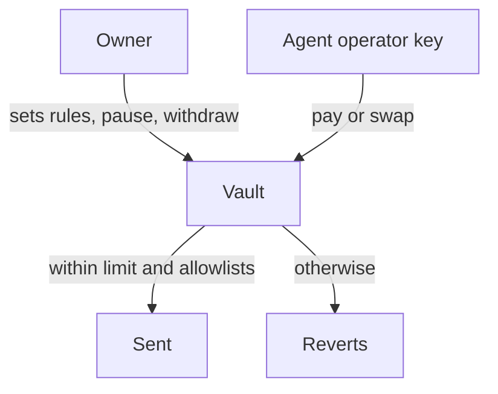

import TemplateInDevelopment from "/snippets/status-template-in-development.mdx";

Understand how the planned AI agent template limits what an agent can do with funds, and apply the same model today with the hand-written guides.

<TemplateInDevelopment />

## Summary

The agent never holds the money. A vault contract does, and it only lets the agent act inside rules that a person sets. If the model is wrong or tricked, or its key leaks, the most it can lose is what's left of one day's limit.

## Why

Instructions in a prompt aren't a security boundary. A model can misread a request or follow text planted in something it reads. A contract check runs every time and can't be talked out of it. See [AI agents on BOT Chain](/guides/ai-agents/overview).

## How

The planned design has two roles, and they must be different wallets:

| Role | Can | Can't |
| --- | --- | --- |
| **Owner** (you) | Set the daily limit, choose allowed recipients and tokens, change the operator, pause, unpause and withdraw | Nothing is held back from the owner |
| **Operator** (the agent's key) | Pay allowed recipients and swap into allowed tokens, within today's limit, while the vault isn't paused | Withdraw, change any rule, or go over the limit |

On top of the contract:

1. **The operator key holds no funds.** It only needs gas.
2. **Every send is simulated first,** so a call that would revert never reaches the chain.
3. **A person approves** payments and larger swaps in the terminal. This is a second line of defence, not the main one.

### If something goes wrong

- **The agent misbehaves.** Pause the vault from the owner wallet, then change the operator.
- **The operator key leaks.** The attacker can spend at most what's left of today's limit, and only to allowed recipients. Pause, change the operator and withdraw.
- **The owner key leaks.** The vault offers no protection. Keep the owner key off any server the agent runs on.

These details come from work in progress and may change before release.

## Do it today

The [Agent vaults](/guides/ai-agents/agent-vaults) and [Spending limits](/guides/ai-agents/spending-limits) guides build the same owner and operator split by hand. Then go through the [security checklist](/guides/ai-agents/security-checklist).

<CardGroup cols={2}>
  <Card title="Agent vaults" icon="vault" href="/guides/ai-agents/agent-vaults">
    Build the vault on testnet.
  </Card>
  <Card title="Human approval" icon="user-check" href="/guides/ai-agents/human-approval">
    Add approvals above a threshold.
  </Card>
  <Card title="Identity hooks" icon="id-card" href="/guides/ai-agents/identity-hooks">
    Check whether a recipient is trusted.
  </Card>
  <Card title="Security checklist" icon="shield" href="/guides/ai-agents/security-checklist">
    Common risks to check before mainnet.
  </Card>
</CardGroup>
