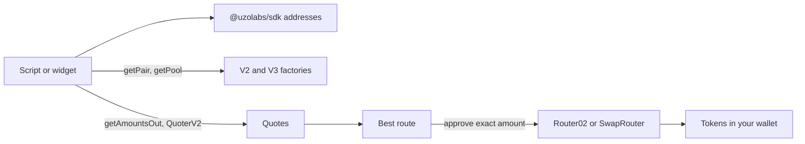

import StatusTemplateReady from "/snippets/status-template-ready.mdx";

Find BDEX pools, compare quotes across every route, and swap BOT, WBOT and USDT from the command line or a browser widget.

<StatusTemplateReady />

{/* screenshot: the swap widget quoting 1 BOT to USDT on four BDEX routes, with the V2 pair marked best (source: templates/dex-integration/docs/screenshot.png) */}

## What it does

This template uses the BDEX pools that are already live, so there's nothing to deploy and you don't need Foundry or Hardhat.

| Script | What it does |
| --- | --- |
| `npm run find-pools` | Lists the V2 pair and the V3 pool for each fee tier (0.01%, 0.05%, 0.3%, 1%) and what each holds |
| `npm run quote` | Prices a swap on every route and marks the best one. Needs no key |
| `npm run wrap` | Turns BOT into WBOT and back, always 1:1 |
| `npm run swap-v2`, `npm run swap-v3` | Approve, then swap, with 0.5% slippage and a 20-minute deadline by default. Both accept BOT in or out |
| `npm run add-liquidity-v2` | Adds to a V2 pair, creating it if needed |

The widget quotes every route as you type, labels the best, and walks you through approve and swap. Every script prints your balances before and after, with a BOTScan link for each transaction.

## Quick start

You need Node.js 20.19+, a browser wallet and some tBOT. See [Prerequisites](/templates/prerequisites). A swap costs about 0.003 tBOT of gas and an approval about 0.001 tBOT.

```bash Terminal
npx giget gh:uzolabs/templates/dex-integration my-dex
cd my-dex && npm install
cp .env.example .env
npm run quote
npm run frontend
```

`npm run quote` works without a key. Open `http://localhost:5173`, connect your wallet and pick BOT on top and USDT below.

<Frame>
  
</Frame>

To send swaps from the scripts, paste your test wallet's key after `PRIVATE_KEY=` in `.env`. To get the USDT that the BDEX pools trade, choose **Test USDT** on the [BOT Chain faucet](https://faucet.botchain.ai/basic), or swap some tBOT for it:

```bash Terminal
npm run swap-v2 -- 1 BOT USDT
```

## How it works



Every BDEX address and ABI comes from `getAddresses(chainId)` in `@uzolabs/sdk/contracts`. Pool addresses are never stored. Each run asks the factories where the pools are. Approvals cover only the amount of the trade.

The [walkthrough](/templates/dex-integration/walkthrough) explains BOT and WBOT, quotes, slippage and the widget.

## Tested on testnet

Every script was run against the live BDEX pools on BOT Chain Testnet on October 1, 2026, with the default 0.5% slippage. The widget was then used with MetaMask to quote and send a swap.

| Command | Result | Transactions |
| --- | --- | --- |
| `npm run wrap -- 0.1` | 0.1 BOT became 0.1 WBOT | [wrap](https://scan.bohr.life/tx/0x0a145093b9384d07104d36a80768d115def32403d28fa9027b2229671d7b68bf) |
| `npm run swap-v2 -- 0.1 BOT USDT` | +1.617485 USDT | [swap](https://scan.bohr.life/tx/0xdff7cee77fa8032ecdf5f8ec20b95753ee340d08560e96f253dc1085f983893a) |
| `npm run swap-v3 -- 0.1 WBOT USDT` | +1.031879 USDT through the 0.3% pool | [approve](https://scan.bohr.life/tx/0xfd37b96c7f803a24a467212cc022db508eee5589a018cd2d4844251d82b71fd0), [swap](https://scan.bohr.life/tx/0x7ed077f58274ad7a9a654bf513d5d27c32e164ce2935ee917c93646c39de726f) |
| `npm run swap-v3 -- 1 USDT BOT --fee 3000` | Paid out as BOT, not WBOT | [approve](https://scan.bohr.life/tx/0x8138cdaf18dc2ea495cfa67ccdd5b788dc425c52110476537fc75c5eed8e97b6), [swap](https://scan.bohr.life/tx/0x0016d7609a83cac246fcae20f134a03671bbf33a21eb5a700af35d64a2bd341e) |

Each swap received exactly the quoted amount. Pool balances and prices change as people trade, so your numbers will differ.

## Links

<CardGroup cols={2}>
  <Card title="Walkthrough" icon="book-open" href="/templates/dex-integration/walkthrough">
    Routes, quotes, slippage and the widget.
  </Card>
  <Card title="Customize" icon="sliders-horizontal" href="/templates/dex-integration/customize">
    Slippage, tokens, multi-hop and exact output.
  </Card>
  <Card title="Source on GitHub" icon="github" href="https://github.com/uzolabs/templates/tree/main/dex-integration">
    The template folder and its README.
  </Card>
  <Card title="Swaps guide" icon="arrow-left-right" href="/guides/defi/swaps/overview">
    The same swaps written by hand.
  </Card>
</CardGroup>
