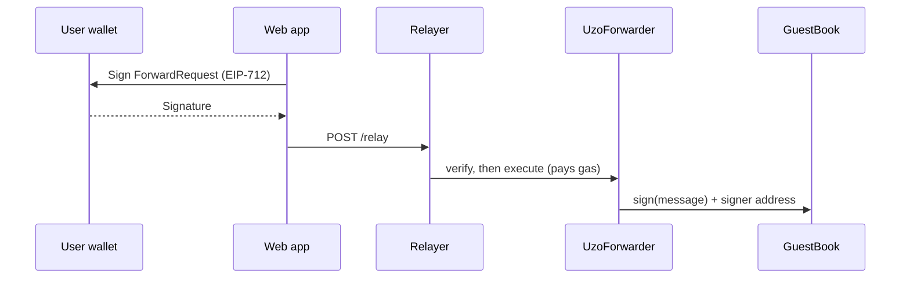

import StatusTemplateReady from "/snippets/status-template-ready.mdx";

Let users with 0 tBOT write to a contract: they sign a message, and your relayer sends the transaction and pays the gas.

<StatusTemplateReady />

{/* screenshot: the guest book page after a wallet holding 0 tBOT has signed, with the status line "Signed. Gas paid by relayer" and the new entry marked "(you)" (source: templates/gasless-app/docs/screenshot.jpg) */}

## What it does

- `UzoForwarder`, OpenZeppelin's `ERC2771Forwarder`. It checks a signed request and passes it on to the target.
- `GuestBook`, an `ERC2771Context` contract. Each entry records the person who signed, not the relayer that paid.
- 26 tests that run under both `forge test` and `hardhat test`, covering direct calls, forwarded calls, expiry, replays and bad signatures.
- A relayer server with `POST /relay` and `GET /health`. It only pays for `GuestBook.sign`, checks every request with the forwarder first, and rate-limits each signer and IP address.
- `npm run sign`, which creates a brand new wallet with 0 tBOT and signs through the relayer.
- A web app with a "Sign for free" button. The wallet asks for a signature, never a transaction.

## Quick start

You need Node.js 20.19+, Foundry, a browser wallet and **two** funded test wallets: a deployer and a relayer. See [Prerequisites](/templates/prerequisites).

```bash Terminal
npx giget gh:uzolabs/templates/gasless-app my-gasless-app
cd my-gasless-app && npm install
cp .env.example .env
```

In `.env`, paste the deployer key after `PRIVATE_KEY=` and the relayer key after `RELAYER_PRIVATE_KEY=`. Keep them separate, because the relayer server holds its key while it runs. Then:

```bash Terminal
npm run deploy
npm run relayer
```

Leave the relayer running. In a second terminal, start the web app:

```bash Terminal
npm run frontend
```

Open `http://localhost:5173`, connect a wallet that holds 0 tBOT, type a message and click "Sign for free". To test from the terminal instead, run `npm run sign -- "gm from the terminal"`.

## How it works



The forwarder appends the signer's address to the calldata. `GuestBook` reads it through `_msgSender()`, so the entry's author is the person who signed. Each request has a nonce and a 10 minute deadline, so it works once only.

The [walkthrough](/templates/gasless-app/walkthrough) covers each check the relayer makes.

## Tested on testnet

Both toolchains were run on BOT Chain Testnet on 1 October 2026, with a separate relayer wallet holding 10 tBOT. Each deploy used 1,455,763 gas for both contracts (0.02911526 tBOT at 20 gwei). Each relayed message used between 96,439 and 136,073 gas, all paid by the relayer. A second wallet also signed two messages from the web app, and its balance and transaction count didn't change.

| Toolchain | UzoForwarder | GuestBook |
| --- | --- | --- |
| Foundry | [0x5Cdb...76Eb](https://scan.bohr.life/address/0x5Cdb6F4348B66f6C0f4cA0c8772968AD749d76Eb?tab=contract) | [0x4aF0...27E8](https://scan.bohr.life/address/0x4aF0c8bE7D7C43F1cF17Bd421F8f7bE7Bd8927E8?tab=contract) |
| Hardhat | [0x9bAb...74C1](https://scan.bohr.life/address/0x9bAb837f41759c737Cb2cC00Ec5D88d5fAcF74C1?tab=contract) | [0x7962...Ac27](https://scan.bohr.life/address/0x7962412A92E5553E66C794c3a352422DEB7BAc27?tab=contract) |

These are example addresses from one run. Your deploy gets its own.

## Links

<CardGroup cols={2}>
  <Card title="Walkthrough" icon="book-open" href="/templates/gasless-app/walkthrough">
    The forwarder, the relayer's checks and the web app.
  </Card>
  <Card title="Customize" icon="sliders-horizontal" href="/templates/gasless-app/customize">
    Relay calls to your own contract.
  </Card>
  <Card title="Source on GitHub" icon="github" href="https://github.com/uzolabs/templates/tree/main/gasless-app">
    The template folder and its README.
  </Card>
  <Card title="Meta-transactions guide" icon="fuel" href="/guides/gasless/meta-transactions">
    The same pattern built by hand.
  </Card>
</CardGroup>
