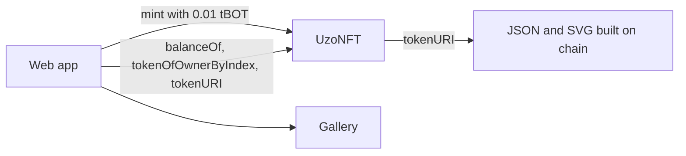

import StatusTemplateReady from "/snippets/status-template-ready.mdx";

Launch an NFT collection with a paid mint and artwork stored fully on chain, and show each wallet's NFTs in a web gallery.

<StatusTemplateReady />

{/* screenshot: the NFT template web app on testnet, showing the collection name, price, minted count, the Mint button and a gallery of coloured on-chain SVG tokens (source: templates/nft/docs/screenshot.png) */}

## What it does

- `UzoNFT`, an ERC-721 built from OpenZeppelin's `ERC721`, `ERC721Enumerable`, `Ownable` and `ReentrancyGuard`.
- A paid `mint()` with a price and a maximum supply. The owner can change the price and withdraw the proceeds.
- `tokenURI` builds each token's JSON and SVG image inside the contract, so there's no IPFS or server to keep online.
- 28 tests that run under both `forge test` and `hardhat test`.
- `npm run mint`, to mint from the command line and decode the new token.
- A web app with a mint button and a gallery of your NFTs that works without event logs.

## Quick start

You need Node.js 20.19+, Foundry, a browser wallet and some tBOT. See [Prerequisites](/templates/prerequisites).

```bash Terminal
npx giget gh:uzolabs/templates/nft my-nft
cd my-nft && npm install
cp .env.example .env
```

Paste your test wallet's private key after `PRIVATE_KEY=` in `.env`. The collection settings are below it:

```bash .env
NFT_NAME="Uzo NFT"
NFT_SYMBOL=UZONFT
NFT_MINT_PRICE=0.01
NFT_MAX_SUPPLY=1000
```

`NFT_MINT_PRICE` is in BOT. Then deploy, start the web app and click "Mint for 0.01 tBOT":

```bash Terminal
npm run deploy
npm run frontend
```

Wait about a minute, then run `npm run verify`. To mint from the terminal instead, run `npm run mint`.

## How it works



`mint()` reverts with `WrongPayment` unless you send exactly the price, and with `SoldOut` once the maximum supply exists. Token IDs start at 1.

To list a wallet's NFTs, the usual approach scans `Transfer` events. BOT Chain's public RPCs don't serve `eth_getLogs`, so the web app uses `ERC721Enumerable` instead: `balanceOf`, then `tokenOfOwnerByIndex` for each index, then `tokenURI` for each token, all batched through Multicall3. The gallery shows the first 48.

The [walkthrough](/templates/nft/walkthrough) covers each file.

## Tested on testnet

The template was deployed and verified with both toolchains on BOT Chain Testnet on 1 October 2026, with the default settings. Each deploy used 2,061,513 gas at 20 gwei (0.04123026 tBOT). Each mint used 146,530 gas plus the 0.01 tBOT price. A mint from the web app was also tested.

| Toolchain | Contract |
| --- | --- |
| Foundry | [0x0E76...75B1](https://scan.bohr.life/address/0x0E766cb54e2E0E30C8f274fc1a7f65d2f53975B1?tab=contract) |
| Hardhat | [0x1f92...2547](https://scan.bohr.life/address/0x1f92495A787eD4Eee427602236264a8b0B802547?tab=contract) |

These are example addresses from one run. Your deploy gets its own.

## Links

<CardGroup cols={2}>
  <Card title="Walkthrough" icon="book-open" href="/templates/nft/walkthrough">
    The contract, the on-chain art and the gallery.
  </Card>
  <Card title="Customize" icon="sliders-horizontal" href="/templates/nft/customize">
    Artwork, royalties, free mints and limits.
  </Card>
  <Card title="Source on GitHub" icon="github" href="https://github.com/uzolabs/templates/tree/main/nft">
    The template folder and its README.
  </Card>
  <Card title="Events without getLogs" icon="list" href="/guides/frontend/events-without-getlogs">
    The pattern the gallery uses.
  </Card>
</CardGroup>
