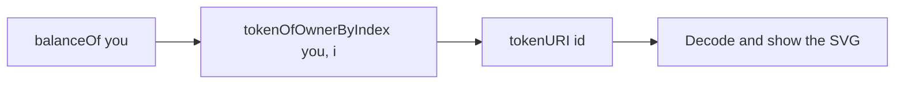

import StatusTemplateReady from "/snippets/status-template-ready.mdx";

Follow the NFT template file by file: the mint rules, the artwork the contract draws itself, and the gallery that finds your tokens without event logs.

<StatusTemplateReady />

## Project layout

```text Project layout
contracts/UzoNFT.sol          the NFT collection
test/UzoNFT.t.sol             Solidity tests, run by Foundry and by Hardhat
script/Deploy.s.sol           Foundry deploy script
ignition/modules/UzoNFT.ts    Hardhat Ignition deploy module
scripts/deploy.ts             runs either deployer, then saves the result
scripts/verify.ts             runs either verifier with the saved arguments
scripts/mint.ts               mints from the command line and decodes the new token
scripts/upload-metadata.ts    optional: pins a token's metadata to IPFS with Pinata
scripts/lib/                  network selection, mainnet guard, Ignition fee hook, helpers
frontend/                     Vite + React + wagmi web app
deployments/<chainId>.json    written by deploy
```

The deploy, verify and toolchain setup work the same way as in the token template. See [Token walkthrough](/templates/token/walkthrough#deploying).

## The contract

`contracts/UzoNFT.sol` combines four OpenZeppelin contracts:

| Parent | What it adds |
| --- | --- |
| `ERC721` | Ownership and transfers of each token |
| `ERC721Enumerable` | Look up tokens by index, which the gallery needs |
| `Ownable` | One owner who can change the price and withdraw |
| `ReentrancyGuard` | Blocks re-entry into `mint` and `withdraw` |

The constructor takes `(name, symbol, mintPrice, maxSupply, owner)`. `maxSupply` is `immutable`, so it can't change after deploy.

| Function | Who | What it does |
| --- | --- | --- |
| `mint()` | Anyone | Pay exactly `mintPrice` to mint the next ID. Reverts with `WrongPayment` or `SoldOut` |
| `setMintPrice(newPrice)` | Owner | Changes the price for future mints |
| `withdraw()` | Owner | Sends the whole balance to the owner. Reverts with `NothingToWithdraw` if empty |

Both functions that move value are `nonReentrant` and update state before any external call. `withdraw` uses a low-level `call`, so an owner that's a contract wallet still gets paid.

## The on-chain artwork

`tokenURI(id)` builds the metadata each time it's called:

1. Hash the token ID to pick a hue from 0 to 359.
2. Draw a 400 by 400 SVG: a diagonal gradient between a light and a dark shade of that hue, with the ID in large white monospace text.
3. Wrap the SVG and the JSON in Base64 and return a `data:application/json;base64,...` URI.

```json Decoded tokenURI
{
  "name": "Uzo NFT #1",
  "description": "A fully on-chain NFT on BOT Chain. The image and this metadata are generated by the contract.",
  "image": "data:image/svg+xml;base64,...",
  "attributes": [{ "trait_type": "Hue", "value": 127 }]
}
```

Wallets, explorers and marketplaces read this format. The contract stores nothing per token beyond its owner, so minting stays cheap.

## Tests

`test/UzoNFT.t.sol` holds 28 tests. They cover payment and supply rules, owner functions, and decode the JSON and SVG that `tokenURI` returns.

```bash Terminal
npm test
npm run test:hardhat
```

## Minting from the command line

```bash Terminal
npm run mint
```

```text Output
Before: you hold 0 NFT(s) and 9.95 tBOT. Minted 0 of 1000.
Mint price: 0.01 tBOT
Minting 1 of 1. Waiting for confirmation: https://scan.bohr.life/tx/0x...
After : you hold 1 NFT(s) and 9.94 tBOT. Minted 1 of 1000.

Newest token: Uzo NFT #1 (hue 127)
  Image: an SVG of 614 characters, stored on chain
  View:  https://scan.bohr.life/token/0x.../instance/1
```

## The web app

`frontend/src/App.tsx` reads the name, price, supply, max supply and owner in one batched call and polls every 10 seconds. The gallery then reads:



All three steps go through Multicall3, so a wallet with many tokens still loads in a few requests. The gallery shows images with ``, which never runs scripts inside an SVG, and only accepts `data:image/svg+xml` images. Errors such as `WrongPayment` and `SoldOut` appear in plain words.

## Optional: pinning to IPFS

The contract doesn't need IPFS. If you change `tokenURI` to point at IPFS, for example for photos too large to store on chain, `scripts/upload-metadata.ts` is a starting point. Set `PINATA_JWT` in `.env` with a key from [Pinata](https://app.pinata.cloud/developers/api-keys), then run:

```bash Terminal
npm run upload-metadata -- 1
```

It pins token 1's SVG, then its JSON pointing at the pinned image, and prints both `ipfs://` links. Without `PINATA_JWT` it does nothing.

{/* untested: the template's README says upload-metadata has not been run with a real Pinata account */}

## Next steps

<CardGroup cols={2}>
  <Card title="Customize" icon="sliders-horizontal" href="/templates/nft/customize">
    Change the art, price rules and royalties.
  </Card>
  <Card title="Read contract state" icon="book-open" href="/guides/frontend/read-contract-state">
    Batched reads with wagmi.
  </Card>
</CardGroup>
