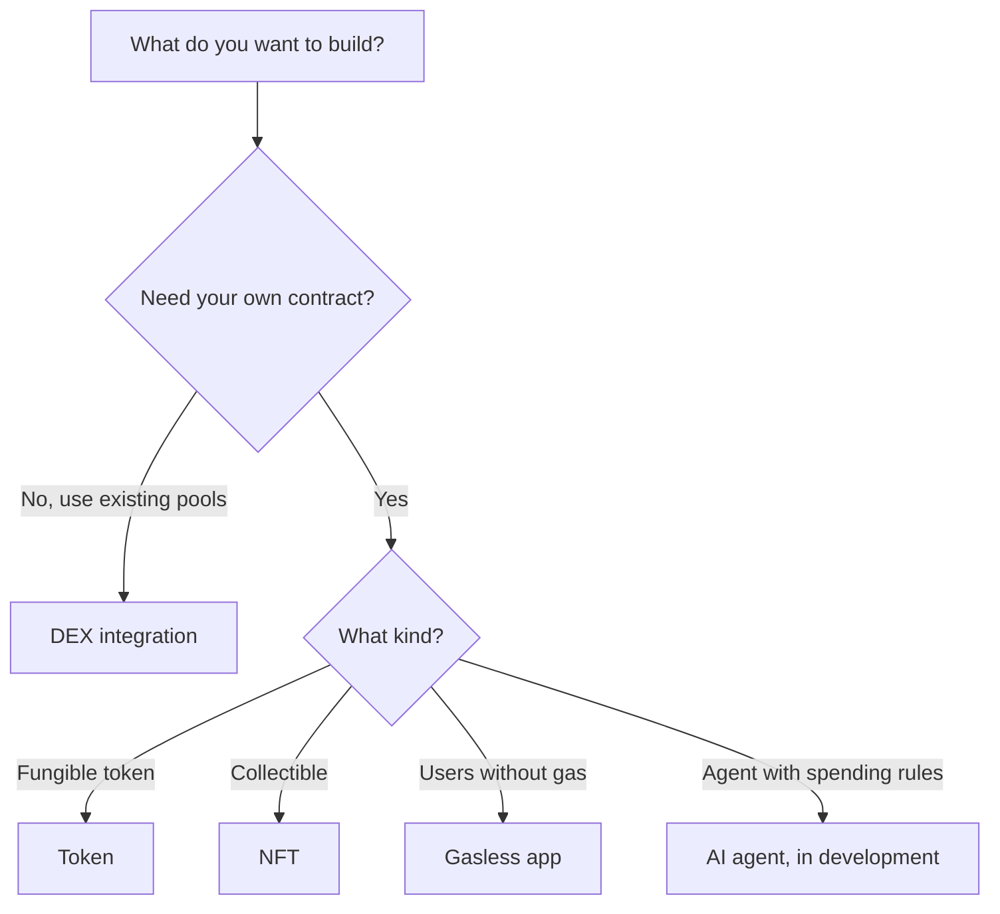

import StatusTemplateReady from "/snippets/status-template-ready.mdx";

Pick a starter project, download it with one command and have a working contract and web app on BOT Chain Testnet in a few minutes.

<StatusTemplateReady />

The status above applies to the four Ready templates. Two more are in development, and each one's page says so at the top.

## What a template gives you

Each template is a folder in [uzolabs/templates](https://github.com/uzolabs/templates) that you copy into your own project. It's a complete, small app, not a snippet:

- Contracts in Solidity 0.8.28 built on OpenZeppelin 5, with tests that run under both Foundry and Hardhat 3.
- `npm run deploy` and `npm run verify` for either toolchain. Deploy writes the new address into the frontend for you.
- A Vite, React and wagmi web app that works on a phone.
- Testnet by default. Mainnet needs a flag and a typed confirmation, and refuses to run in CI.
- Chain IDs, RPC URLs and contract addresses read from [`@uzolabs/sdk`](/sdk/overview), so nothing is hard-coded.
- A README that records a real testnet deploy, with BOTScan links.

## Which template to start with

| Template | What it teaches | Status |
| --- | --- | --- |
| [Token](/templates/token/index) | Create, deploy and verify an ERC-20, then send it from a web app | Ready |
| [NFT](/templates/nft/index) | A paid mint with on-chain SVG art and a gallery that works without event logs | Ready |
| [DEX integration](/templates/dex-integration/index) | Find pools, quote and swap on BDEX V2 and V3. No contracts to deploy | Ready |
| [Gasless app](/templates/gasless-app/index) | Users with 0 tBOT sign a message and a relayer pays the gas (ERC-2771) | Ready |
| [Bridge integration](/templates/bridge-integration/index) | Send USDT out of BOT Chain through the bridge | In development |
| [AI agent](/templates/ai-agent/index) | An agent that pays from a vault with a daily limit and your approval | In development |

If you're new to BOT Chain, start with the token template. It has the fewest moving parts and the same deploy and verify flow as the others.

## Templates repo or Uzo Deploy?

If you only need a standard token, NFT collection or tip jar, [Uzo Deploy](/deploy/overview) deploys and verifies one from your browser, with no setup. Use a template from this repo when you want to change the contract, add a frontend or build a project on top. See the [full comparison](/deploy/overview#uzo-deploy-or-the-templates-repo).

## How to choose

<CardGroup cols={2}>
  <Card title="Use a template" icon="play" href="/templates/using-templates">
    The same five steps for every template.
  </Card>
  <Card title="Prerequisites" icon="list-checks" href="/templates/prerequisites">
    Node.js, Foundry, a wallet and tBOT.
  </Card>
  <Card title="Token template" icon="coins" href="/templates/token/index">
    The best first template.
  </Card>
  <Card title="Add a template" icon="git-pull-request" href="/templates/contributing/add-a-template">
    Rules for contributing your own.
  </Card>
</CardGroup>
