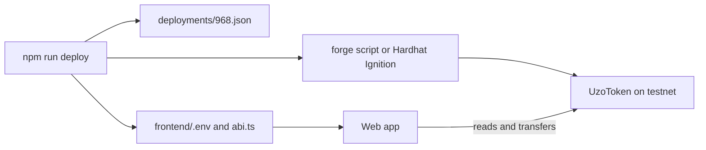

import StatusTemplateReady from "/snippets/status-template-ready.mdx";

Create your own ERC-20 token, deploy and verify it on BOT Chain Testnet, and send it from a web app.

<StatusTemplateReady />

{/* screenshot: the token template web app on testnet, connected to MetaMask, showing the token name, symbol, total supply, the connected balance and the Send form (source: templates/token/docs/screenshot.png) */}

## What it does

- `UzoToken`, an ERC-20 built from OpenZeppelin's `ERC20`, `ERC20Permit` and `Ownable`. The owner can mint more.
- 18 tests that run under both `forge test` and `hardhat test`.
- `npm run deploy` and `npm run verify` for Foundry, plus `deploy:hardhat` and `verify:hardhat`.
- `npm run transfer`, to send tokens from the command line.
- A web app that shows the token's details and your balance and sends tokens, with a BOTScan link for each transaction.

## Quick start

You need Node.js 20.19+, Foundry, a browser wallet and some tBOT. See [Prerequisites](/templates/prerequisites).

```bash Terminal
npx giget gh:uzolabs/templates/token my-token
cd my-token && npm install
cp .env.example .env
```

Paste your test wallet's private key after `PRIVATE_KEY=` in `.env`, then deploy and start the web app:

```bash Terminal
npm run deploy
npm run frontend
```

Open `http://localhost:5173` and connect your wallet. Wait about a minute, then run `npm run verify` to publish the source on BOTScan.

To name your token, set these in `.env` before you deploy:

```bash .env
TOKEN_NAME="Uzo Token"
TOKEN_SYMBOL=UZO
TOKEN_INITIAL_SUPPLY=1000000
```

`TOKEN_INITIAL_SUPPLY` is in whole tokens. The deployer receives it and becomes the owner.

## How it works



The deploy script checks that the RPC is really BOT Chain Testnet and that your wallet has gas, deploys with your chosen toolchain, then writes the address into the web app. The web app reads the token through one batched Multicall3 call every 10 seconds. It never asks for event logs, because BOT Chain's public RPCs don't serve `eth_getLogs`.

The [walkthrough](/templates/token/walkthrough) goes file by file.

## Tested on testnet

The template was deployed and verified with both toolchains on BOT Chain Testnet on 1 October 2026. Each deploy used 1,093,577 gas at 20 gwei, which is 0.02187154 tBOT.

| Toolchain | Contract |
| --- | --- |
| Foundry | [0xd757...8561](https://scan.bohr.life/address/0xd757C1B8410DDFa84F5Ba9AD9f9F7580Bf958561?tab=contract) |
| Hardhat | [0x052a...DC46](https://scan.bohr.life/address/0x052a24B1ECAdea3eb50C71D3c7DA9Ba15318DC46?tab=contract) |

These are example addresses from one run. Your deploy gets its own.

## Links

<CardGroup cols={2}>
  <Card title="Walkthrough" icon="book-open" href="/templates/token/walkthrough">
    Every file and what it does.
  </Card>
  <Card title="Customize" icon="sliders-horizontal" href="/templates/token/customize">
    Fixed supply, burning, a cap and more.
  </Card>
  <Card title="Source on GitHub" icon="github" href="https://github.com/uzolabs/templates/tree/main/token">
    The template folder and its README.
  </Card>
  <Card title="Deploy by hand" icon="hammer" href="/guides/deploy/deploy-with-foundry">
    The same deploy and verify steps without the template.
  </Card>
</CardGroup>
